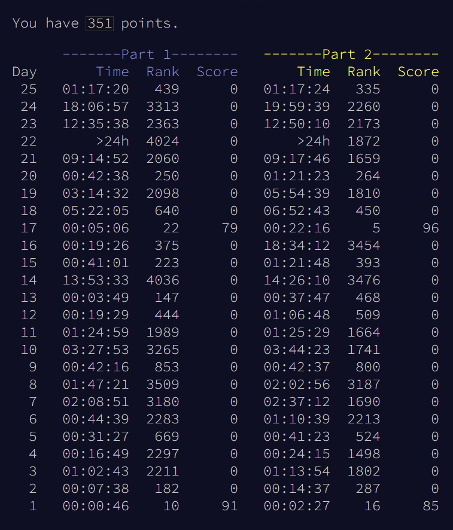
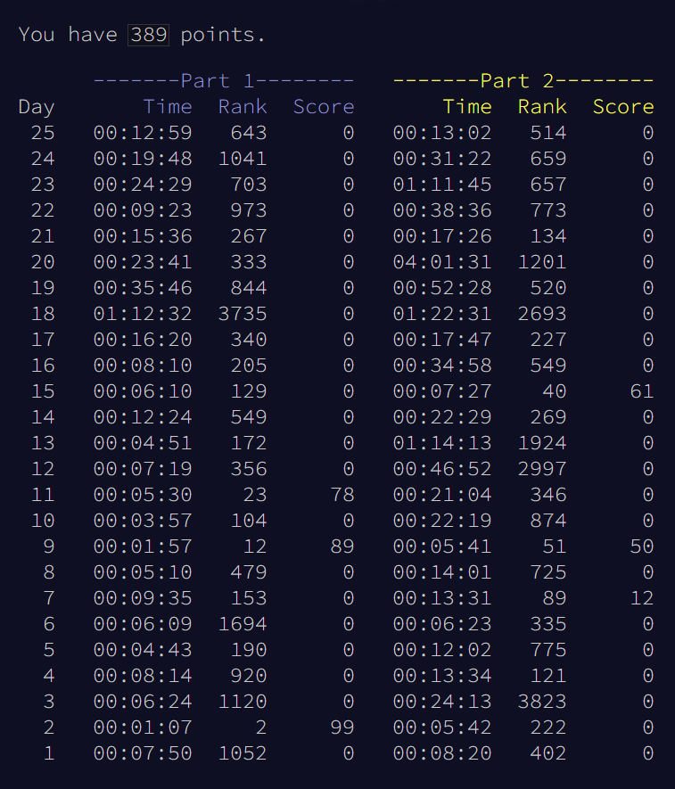
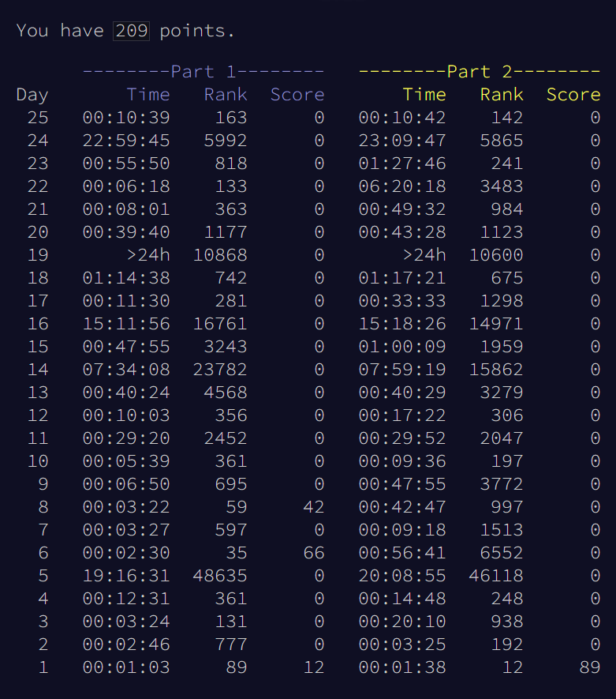

Here lies my solutions to [Advent of Code](https://adventofcode.com/), an Advent calendar full of programming puzzles from December 1st all the way to Christmas.

For the 2019, 2020 and 2021 events, I actively competed for spots in the daily leaderboards, and I did manage to snag some! Here are my personal stats for those years:

2019 | 2020 | 2021
:---:|:---:|:---:
 |  | 

I also wrote some blog posts about the [2019](https://www.gabekanegae.com/advent-of-code-2019-in-review/) and [2020](https://www.gabekanegae.com/advent-of-code-2020-in-review/) events right after they ended, highlighting a few of my favorite days. The source code for the graph shown in the 2020's post is in [2020/time-plots](2020/time-plots).

## Inputs and Outputs

All inputs are read from `YYYY/inputs/inputDD.txt`, with `YYYY` being the year and `DD` being the zero-padded day. As per the creator's request, they are not available in this repository and should be downloaded directly from the event website.

The only outputs for all days are exactly what should be pasted in the puzzle answer textbox, followed by the total runtime of both parts combined (via Python's `time.perf_counter()`), no more and no less. In some cases, helpful debugging code or other verbose messages are simply commented out, and can be manually toggled to better understand the code inner workings.

## Implementation Goals

The solutions posted here are cleaned-up versions of the actual code written when aiming for the leaderboards. For all solutions, the main implementation goals were, in descending order:

* **Readability:** Clean, readable, self-explanatory and commented code above all else.
* **Input Generalization:** Should work not only for my input but for anyone's, with some assumptions made about it, which are noted when appropriate.
* **Modularity:** Avoid duplicate code where possible, allowing for easy modification by making heavy use of classes and functions. 
* **Speed:** Use efficient algorithms, keeping runtime reasonably low without extreme micro-optimizations.
* **Minimal Imports:** Refrain from `import`s besides utilities (`sys`, `time`) and basic standard libraries (`math`, `itertools`, `collections`). When the knowledge of functions and structures are considered vital to the problem solution (graphs, trees, linked lists, union-find, etc.), reimplement them.

And, specifically for 2019's **Intcode**:

* **Black Box Intcode:** Treat all Intcode programs as Black Boxes, interacting with them only as described in the puzzle statements. Although it's sometimes possible to solve them faster and with less code by reverse-engineering and modifying or extracting values directly from the Intcode programs, that approach was not considered. Maybe I'll leave that for another time? ;)

## Thanks!

Many thanks to [Eric Wastl](http://was.tl/), who creates Advent of Code, as well as to the amazing community over at [/r/adventofcode](https://www.reddit.com/r/adventofcode/)!
